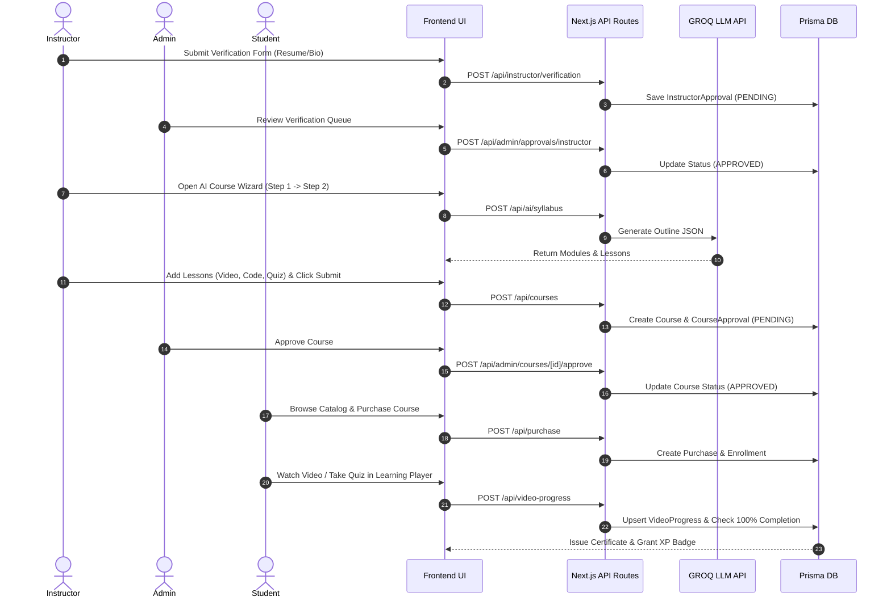

# Complete Feature Architecture & Backend Integration Guide (`api_doc.md`)

This document provides a comprehensive analysis of all **features created in Glarus Academy**, how to build the **backend for each feature**, and how all system modules **connect to each other** into an end-to-end learning lifecycle.

---

## SECTION 1: Feature Inventory & Functional Analysis

### 1. Authentication & Role-Based Security
- **Multi-Role User Authentication**: Supports `STUDENT`, `INSTRUCTOR`, and `ADMIN` accounts.
- **Session Management**: JWT session cookies issued using `jose` with HTTP-Only, Secure, SameSite settings.
- **Password Security**: Passwords hashed using `bcryptjs` (10 salt rounds).
- **Protected Routes**: Next.js Middleware gates access based on role (`/instructor`, `/admin`, `/learn`).

### 2. Instructor Course Creation Suite & 4-Step AI Wizard
- **Step 1 — Basic Details**: Captures Course Title, Subtitle, Category, Skill Level, Price (₹), and Description.
- **Step 2 — AI Syllabus Generation**: Interfaces with GROQ LLM (`llama3-70b-8192`) to auto-generate structured modules and lesson breakdowns. Features inline re-roll, module editing, and custom lesson creation.
- **Step 3 — Content & Media Studio**: Lesson content editor supporting 5 content types:
  - 📹 **Video Lectures**: Embed URL or video source.
  - 💻 **Monaco Code Sandbox**: Live Python/JS code execution with starter templates.
  - ❓ **Interactive Quizzes**: Multiple-choice questions with option explanations.
  - 📄 **Downloadable Resources**: PDFs, slides, and attachment links.
  - 🖼️ **Diagrams & Media**: High-res schematics with captions.
- **Step 4 — Final Review**: Summarizes course metrics and submits to the Admin Approval Queue.

### 3. AI Quiz Generator Wizard (3-Step Guided Workflow)
- **Step 1 — Generate**: Configures topic, difficulty (`Easy`, `Medium`, `Hard`, `Mixed`), question count (5-25), question types, and custom AI prompt instructions.
- **Step 2 — Review & Edit**: Displays editable question cards, option selectors, explanation inputs, and AI re-generation controls.
- **Step 3 — Interactive Preview & Save**: Allows live quiz previewing with instant scoring before persisting to the database.

### 4. Instructor Assignments Dashboard
- **KPI Summary Cards**: Real-time stats (`Total`, `Published`, `Drafts`, `To Review`, `Closed`, `Avg Score`).
- **Linear-style Toolbar**: Instant text search, status tab filters (`All`, `Published`, `Drafts`, `Closed`), and course selector.
- **Submission Progress & Urgency**: Dynamic due date urgency badges (`Due Today`, `Ended`), progress bars, and submission review modals.

### 5. Student Learning Player & Monaco Code Sandbox
- **Custom Learning Player**: Video player with real-time watch timestamp tracking.
- **Monaco Code Editor**: Live coding environment integrated with Pyodide / Web sandbox execution.
- **AI Tutor Assistant Widget**: Floating AI chat widget offering contextual assistance per lesson.
- **Progress Persistence**: Auto-saves video progress percentage to Prisma backend on pause or periodic heartbeat.

### 6. Admin Portal & Verification Queue
- **Instructor Verification Queue**: Reviews resume URLs, technical experience, and bio details (`PENDING`, `APPROVED`, `REJECTED`, `CHANGES_REQUESTED`).
- **Course Review Queue**: Audits course curriculum preview before publishing to the public catalog.
- **System Audit Logs**: Records administrative actions with timestamps and admin user IDs.

### 7. Certificates & XP Achievements Engine
- **Completion Tracking**: Verifies 100% course module completion.
- **Certificate Generation**: Issues verifiable certificates with unique URLs.
- **Gamification**: XP points and milestone badge unlocks.

---

## SECTION 2: Backend Architecture per Feature

### 1. Database Schemas (`prisma/schema.prisma`)

```prisma
// Core User & Profiles
model User {
  id                 String              @id @default(cuid())
  name               String
  email              String              @unique
  password           String
  role               Role                @default(STUDENT)
  status             UserStatus          @default(ACTIVE)
  courses            Course[]            @relation("InstructorCourses")
  purchases          Purchase[]
  enrollments        Enrollment[]
  videoProgress      VideoProgress[]
  certificates       Certificate[]
  instructorApproval InstructorApproval?
}

// Course Hierarchy
model Course {
  id           String         @id @default(cuid())
  title        String
  description  String
  price        Float
  instructorId String
  instructor   User           @relation("InstructorCourses", fields: [instructorId], references: [id])
  status       CourseStatus   @default(PENDING)
  modules      Module[]
  enrollments  Enrollment[]
}

model Module {
  id       String    @id @default(cuid())
  title    String
  courseId String
  course   Course    @relation(fields: [courseId], references: [id])
  lectures Lecture[]
  order    Int
}

model Lecture {
  id        String          @id @default(cuid())
  title     String
  videoUrl  String?
  moduleId  String
  module    Module          @relation(fields: [moduleId], references: [id])
  progress  VideoProgress[]
  order     Int
}

model VideoProgress {
  id              String   @id @default(cuid())
  userId          String
  lectureId       String
  progressSeconds Float    @default(0)
  isCompleted     Boolean  @default(false)
  updatedAt       DateTime @updatedAt
  user            User     @relation(fields: [userId], references: [id])
  lecture         Lecture  @relation(fields: [lectureId], references: [id])

  @@unique([userId, lectureId])
}
```

---

### 2. Backend API Endpoint Logic Blueprints

#### A. AI Syllabus Generator Backend (`/api/ai/syllabus/route.ts`)
```typescript
import { NextResponse } from "next/server";
import Groq from "groq-sdk";

const groq = new Groq({ apiKey: process.env.GROQ_API_KEY });

export async function POST(req: Request) {
  try {
    const { topic } = await req.json();
    const prompt = `Generate a structured course syllabus for topic "${topic}". Return JSON in format: { modules: [{ title: string, lessons: string[] }] }`;

    const completion = await groq.chat.completions.create({
      messages: [{ role: "user", content: prompt }],
      model: "llama3-70b-8192",
      response_format: { type: "json_object" }
    });

    const data = JSON.parse(completion.choices[0].message.content || "{}");
    return NextResponse.json(data);
  } catch (error) {
    return NextResponse.json({ error: "AI Syllabus generation failed" }, { status: 500 });
  }
}
```

#### B. Video Progress Sync Backend (`/api/video-progress/route.ts`)
```typescript
import { NextResponse } from "next/server";
import { prisma } from "@/lib/prisma";
import { verifyAuth } from "@/lib/auth";

export async function POST(req: Request) {
  const user = await verifyAuth(req);
  if (!user) return NextResponse.json({ error: "Unauthorized" }, { status: 401 });

  const { lectureId, progressSeconds, isCompleted } = await req.json();

  const progress = await prisma.videoProgress.upsert({
    where: { userId_lectureId: { userId: user.id, lectureId } },
    update: { progressSeconds, isCompleted },
    create: { userId: user.id, lectureId, progressSeconds, isCompleted }
  });

  return NextResponse.json(progress);
}
```

---

## SECTION 3: Inter-Module Connection & End-to-End System Flow



---

## SECTION 4: Connecting Frontend State to Backend APIs

| Frontend State / Component | Trigger Event | Backend API Route | Prisma DB Operations |
| :--- | :--- | :--- | :--- |
| `InstructorDashboard` (`formData`) | Save Basic Info & Continue | `POST /api/courses` | `prisma.course.create()` |
| `aiModules` array | Click "Generate Outline" | `POST /api/ai/syllabus` | None (Stateless LLM execution) |
| `quizWizardStep` state | Save Generated Quiz | `POST /api/ai/quiz` | `prisma.lecture.update()` |
| `InstructorAssignmentsView` | Review Submissions Modal | `GET /api/instructor/students` | `prisma.enrollment.findMany()` |
| `VideoProgress` component | Video Pause / 10s Heartbeat | `POST /api/video-progress` | `prisma.videoProgress.upsert()` |
| `InstructorVerificationForm` | Submit Verification | `POST /api/instructor/verification` | `prisma.instructorApproval.upsert()` |
| `AdminApprovalsView` | Click "Approve / Reject" | `POST /api/admin/approvals/course` | `prisma.courseApproval.update()` |

---

### Summary Checklist for Backend Setup

1. **Environment Variables (`.env`)**: Ensure `DATABASE_URL="file:./dev.db"`, `JWT_SECRET`, and `GROQ_API_KEY` are configured.
2. **Database Migrations**: Run `npx prisma db push` to generate client types and keep local SQLite DB in sync.
3. **Route Protection**: Wrap API routes using `verifyAuth(req)` helper to enforce Role-Based Access Control (`STUDENT`, `INSTRUCTOR`, `ADMIN`).
