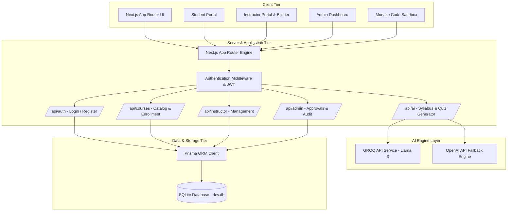
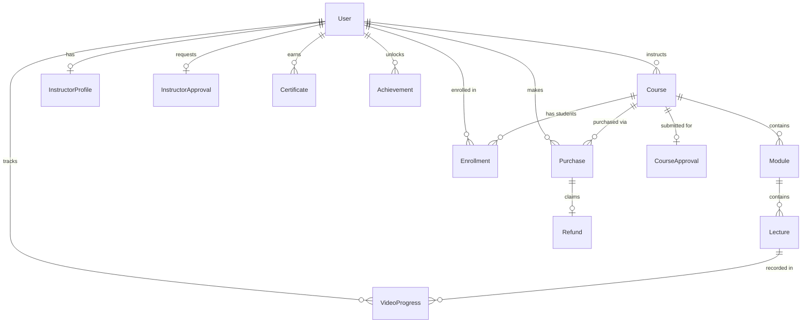

# System Architecture & Technical Specifications — Glarus Academy

**Glarus Academy** is an AI-powered Learning Management System (LMS) and Course Creation Platform designed for high-performance interactive learning, AI-assisted curriculum building, and instructor management.

---

## 1. Executive Summary & Core Stack

| Tier | Technologies Used |
| :--- | :--- |
| **Frontend Framework** | Next.js 16 (App Router), React 19, TypeScript |
| **Styling & Animation** | Tailwind CSS v4, Framer Motion, GSAP, Lucide Icons |
| **Code Editor & UI** | Monaco Editor (`@monaco-editor/react`), React Syntax Highlighter, Canvas Confetti |
| **ORM & Database** | Prisma ORM, SQLite Database (`dev.db`) |
| **Authentication & Auth Security** | JSON Web Tokens (`jose`), `bcryptjs`, HTTP-Only Cookies, RBAC |
| **AI Copilot & Generation Engine** | GROQ SDK (`groq-sdk` / Llama-3 70B & 8B), OpenAI SDK (`openai`) |
| **Data Visualization** | Recharts (`recharts`) |
| **State Management** | Zustand, React Local & Context State |

---

## 2. System Architecture Diagram



---

## 3. Data Model & Entity Relationship (ER Architecture)

The system relies on Prisma ORM with SQLite backend enforcing strict relational integrity across 18 entities.



### Core Schema Models Highlights (`prisma/schema.prisma`)

1. **User & Roles**: Supports `STUDENT`, `INSTRUCTOR`, and `ADMIN` with status `ACTIVE` / `BLOCKED`.
2. **InstructorApproval & CourseApproval**: Multi-step verification queue (`PENDING`, `APPROVED`, `REJECTED`, `CHANGES_REQUESTED`) with feedback audit tracking.
3. **Course, Module & Lecture**: Hierarchical structure for video lectures, Monaco sandboxes, interactive quizzes, and downloadable resources.
4. **VideoProgress & UserActivity**: Tracks watch duration, completion status, and resume positions per user per lecture.
5. **Purchase & Refund**: Payment recording and refund lifecycle managed by Admins.

---

## 4. Key Portal Features & Architecture

### A. Instructor Portal & Course Creation Suite (`/instructor`)
- **4-Step AI Course Wizard**:
  - **Step 1 — Basic Info**: Course title, tagline, category, level, price, and description.
  - **Step 2 — AI Syllabus Generation**: GROQ LLM generates structured module and lesson breakdowns instantly with re-roll and edit options.
  - **Step 3 — Content & Media**: Integrated Course Builder for uploading videos, interactive code sandboxes, quizzes, and files.
  - **Step 4 — Final Review**: Final course audit and submission to Admin Queue.
- **AI Quiz Generator Wizard**:
  - Guided 3-step workflow: **Generate → Review & Edit → Interactive Preview → Save**.
  - Configurable parameters: Difficulty (`Easy`, `Medium`, `Hard`, `Mixed`), Question types, and Custom Prompt tweaks.
- **Assignments Management System**:
  - Linear-style dashboard with KPI stat cards, tab filters, progress bars, and grading interface for student submissions.

### B. Student Learning Portal (`/learn`, `/courses`, `/dashboard`)
- **Interactive Course Player**: Next-gen video player with auto progress saving to Prisma.
- **Monaco Live Code Sandbox**: Embedded code execution environment for Python, JavaScript, and Web technologies.
- **Gamified Achievements & Certificates**: Auto-generated certificates on course completion and XP badge unlocks.

### C. Admin & Oversight Portal (`/admin`)
- **Approval Queues**: Review instructor verification requests and pending course submission contents.
- **Platform Analytics**: Revenue commission metrics, active users, and system audit logs.

---

## 5. API Route Architecture

| Route Endpoint | Method | Purpose |
| :--- | :--- | :--- |
| `/api/auth/login` | `POST` | Validates credentials, sets HTTP-only JWT cookie |
| `/api/auth/signup` | `POST` | Registers new student/instructor account with hashed password |
| `/api/ai/syllabus` | `POST` | Calls GROQ LLM to auto-generate course module/lesson outlines |
| `/api/ai/quiz` | `POST` | Generates customizable multi-choice & coding quiz questions |
| `/api/ai/chat` | `POST` | AI Tutor assistance for students during lesson playback |
| `/api/courses` | `GET` / `POST` | Fetches approved course catalog or submits new course |
| `/api/instructor/courses` | `GET` | Fetches instructor's personal created courses |
| `/api/instructor/stats` | `GET` | Calculates revenue, student enrollments, and ratings |
| `/api/instructor/verification` | `GET` / `POST` | Handles instructor identity & credential verification |
| `/api/video-progress` | `POST` | Records real-time video watch timestamps & progress % |
| `/api/admin/approvals` | `GET` / `POST` | Approves/rejects course content and instructor applications |

---

## 6. Directory Layout Structure

```
c:/Users/Admin/Desktop/glarus achedmy/frontend/
├── prisma/
│   └── schema.prisma              # Database schema & Prisma client models
├── src/
│   ├── app/
│   │   ├── admin/                 # Admin Dashboard pages
│   │   ├── api/                   # REST API Routes (AI, Auth, Courses, Admin)
│   │   ├── course/[id]/           # Course Detail & Syllabus view
│   │   ├── instructor/            # Instructor Portal & AI Wizards
│   │   ├── learn/                 # Interactive Student Player & Monaco Sandbox
│   │   ├── login/ & signup/       # Auth pages
│   │   ├── page.tsx               # Homepage Landing Page
│   │   └── layout.tsx             # Root layout with providers & navigation
│   └── components/
│       ├── admin/                 # Admin view components
│       ├── engine/                # AI engine components
│       ├── instructor/            # InstructorAssignmentsView & Course Builder
│       └── student/               # Student Dashboard & Course player components
└── package.json                   # Dependencies & Build Scripts
```

---

## 7. Security & Best Practices

1. **Authentication & Authorization**: Password hashing via `bcryptjs` (salt rounds: 10), HTTP-only secure cookies via `jose` JWTs, with middleware role-gating (`STUDENT`, `INSTRUCTOR`, `ADMIN`).
2. **Database Performance**: Indexed lookup on CUID primary keys and `@@unique` constraints on user progress and certificate records.
3. **Resilient AI Fallbacks**: Structured JSON outputs enforced via GROQ Llama-3 API with error retries and client fallback templates.
