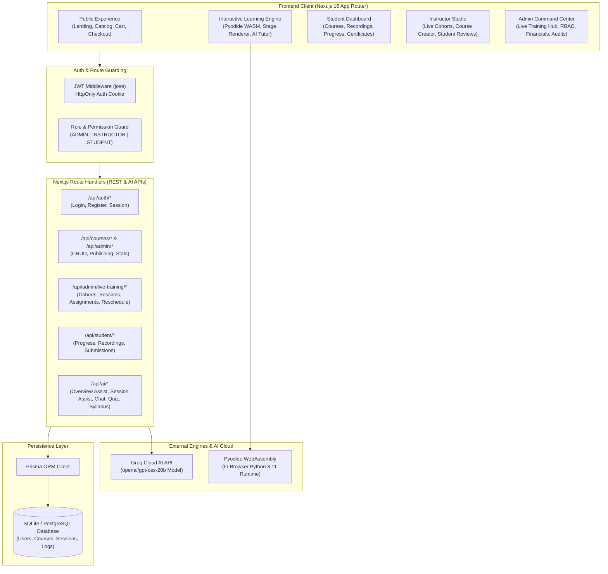
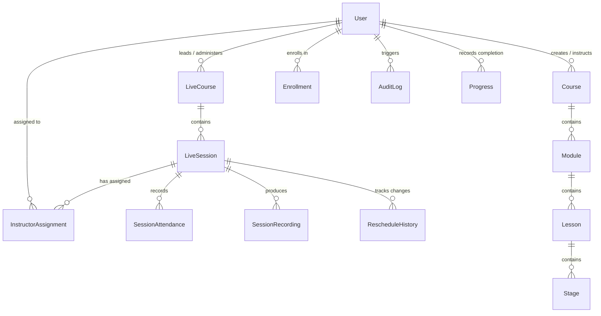
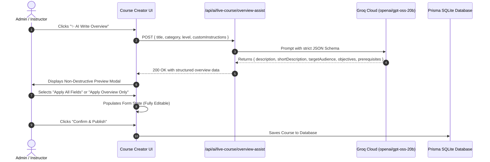

# Glarus Academy — Enterprise AI EdTech Platform
## Complete System Architecture, Engineering Design & Technical Documentation

---

## Table of Contents
1. [Executive Summary & Platform Mission](#1-executive-summary--platform-mission)
2. [High-Level System Architecture](#2-high-level-system-architecture)
3. [Technology Stack & Core Decisions](#3-technology-stack--core-decisions)
4. [Database Schema & Entity Relationship Model](#4-database-schema--entity-relationship-model)
5. [User Roles & Role-Based Access Control (RBAC)](#5-user-roles--role-based-access-control-rbac)
6. [Core Platform Subsystems](#6-core-platform-subsystems)
   - [A. Public Experience & Course Catalog](#a-public-experience--course-catalog)
   - [B. Interactive Student Learning Engine (Self-Paced)](#b-interactive-student-learning-engine-self-paced)
   - [C. Student Portal & Workspace](#c-student-portal--workspace)
   - [D. Instructor Studio & Cohort Operations](#d-instructor-studio--cohort-operations)
   - [E. Super Admin Command Center & Live Training Hub](#e-super-admin-command-center--live-training-hub)
7. [AI Subsystem & Groq LLM Architecture](#7-ai-subsystem--groq-llm-architecture)
8. [Complete API Route Directory](#8-complete-api-route-directory)
9. [Project Directory & File Structure](#9-project-directory--file-structure)
10. [Local Development, Environment & Deployment Guide](#10-local-development-environment--deployment-guide)

---

## 1. Executive Summary & Platform Mission

**Glarus Academy** is a modern, enterprise-grade AI Education & Live Training Platform designed to take learners from foundational concepts to production AI engineering. The platform bridges the gap between self-paced interactive learning and high-intensity, live cohort-based bootcamps.

### Key Capabilities:
- **Interactive Self-Paced Learning Engine**: Full-screen slide/stage engine featuring client-side WebAssembly Python execution (via Pyodide), real-time code evaluation, interactive diagrams, scenario practices, quizzes, and an AI Discussion Tutor.
- **Live Training & Cohort Management**: Comprehensive administrative suite for scheduling, orchestrating, and tracking live interactive bootcamps, workshops, instructor assignments, attendance, recordings, and rescheduling audit trails.
- **AI-Powered Course & Session Architect**: Groq-powered AI copilots that assist admins and instructors in generating complete 5-step course curriculums, session agendas, learning outcomes, deliverables, and course overviews in seconds.
- **Role-Based Portals**: Tailored workflows and UI interfaces for **Super Admins**, **Instructors**, and **Students**.

---

## 2. High-Level System Architecture



---

## 3. Technology Stack & Core Decisions

| Layer | Technology | Rationale & Architecture Role |
| :--- | :--- | :--- |
| **Core Framework** | **Next.js 16 (App Router)** | Full-stack React 19 architecture with Server/Client Components, dynamic routing, and fast route handlers. |
| **Language** | **TypeScript 5** | Strict type safety across frontend state, database schemas, and AI payload structures. |
| **Styling & Design System** | **TailwindCSS v4 & Vanilla CSS** | Custom dark-mode-first aesthetic with glowing borders, glassmorphism (`backdrop-blur`), and tailored CSS design tokens. |
| **Animations** | **Framer Motion** | Smooth modal entrances, accordions, progress transitions, and interactive slide transitions. |
| **Icons** | **Lucide React** | Consistent, modern vector iconography across all portal sidebars, buttons, and badges. |
| **Client-Side Code Runner** | **Pyodide (WebAssembly)** | Zero-latency, sandboxed Python 3 execution inside the browser without requiring external server compute for introductory code exercises. |
| **ORM & Database** | **Prisma ORM + SQLite** | Declarative schema modeling, automatic migration history, and relationship queries. (Easily switchable to PostgreSQL). |
| **Authentication & Tokens** | **jose (JWT) & bcryptjs** | Secure password hashing, stateless JWT issuance in HttpOnly cookies (`auth_token`). |
| **AI LLM Inference** | **Groq Cloud API** | Ultra-low latency inference using `openai/gpt-oss-20b` for JSON-structured course generation, session agendizing, and overview crafting. |
| **State Management** | **Zustand** | Lightweight reactive stores for Cart, Wishlist, Course Progress, and UI panel toggles. |

---

## 4. Database Schema & Entity Relationship Model



### Key Prisma Models:
1. **`User`**: Core identity model supporting `ADMIN`, `INSTRUCTOR`, and `STUDENT` roles.
2. **`LiveCourse`**: Cohort-based live training course containing scheduling frequency, lead instructor, target audience, price, capacity, and status (`DRAFT`, `PUBLISHED`, `IN_PROGRESS`, `COMPLETED`, `ARCHIVED`).
3. **`LiveSession`**: Individual session belonging to a `LiveCourse`. Stores `date`, `startTime`, `endTime`, `duration`, `status` (`SCHEDULED`, `LIVE`, `COMPLETED`, `RESCHEDULED`, `CANCELLED`), meeting URL, JSON agenda, topics, learning outcomes, resources, and homework.
4. **`InstructorAssignment`**: Granular RBAC assignment linking an instructor to a session with 10 specific boolean permissions (`canEdit`, `canEditAgenda`, `canEditSchedule`, `canEditResources`, `canAddHomework`, `canReschedule`, `canCancel`, `canManageAttendance`, `canManageRecording`, `canView`).
5. **`RescheduleHistory`**: Immutable audit record created whenever an admin or instructor reschedules a session. Captures `previousDate`, `newDate`, `previousStartTime`, `newStartTime`, `reason`, and `rescheduledBy`.
6. **`AuditLog`**: Platform-wide security trail tracking who made what changes across live courses, permissions, and sessions.

---

## 5. User Roles & Role-Based Access Control (RBAC)

The platform enforces strict role differentiation across the UI and API layers:

| Role | Access Scope | Allowed Operations |
| :--- | :--- | :--- |
| **Super Admin (`ADMIN`)** | Entire Platform (`/admin/*`) | • Full Live Course & Session lifecycle (Create, Publish, Reschedule, Cancel, Delete)<br>• Instructor RBAC permissions management<br>• User verifications & management<br>• Financials & Refunds oversight<br>• Master Audit Logs & Platform Settings |
| **Instructor (`INSTRUCTOR`)** | Instructor Studio (`/instructor/*`) | • Manage assigned Live Cohorts & Sessions<br>• Execute assigned actions strictly bounded by granted permissions (e.g. edit agenda, manage attendance, update recordings)<br>• Review student homework & provide live feedback |
| **Student (`STUDENT`)** | Student Portal & Learn (`/dashboard`, `/learn/*`, `/student/*`) | • Access enrolled self-paced courses with interactive WASM engine<br>• Join scheduled live sessions and view meeting links<br>• Stream recorded live sessions (if enabled for enrollment tier)<br>• Track certificates, assignments, and payments |

---

## 6. Core Platform Subsystems

### A. Public Experience & Course Catalog
- **Landing Page (`/`)**: Hero section showcasing AI programs, internships, feature badges, top courses carousel, curriculum highlights, and instructor spotlights.
- **Course Catalog (`/courses`)**: Searchable, filterable catalog supporting both self-paced interactive courses and live cohorts with pricing, difficulty ratings, and category filters.
- **Cart & Checkout (`/cart`, `/checkout`)**: Shopping cart and order checkout simulation with coupon code application and immediate enrollment.

---

### B. Interactive Student Learning Engine (Self-Paced)
- **Route**: `/learn/[courseId]`
- **Distraction-Free Full-Screen Mode**: The top navigation automatically transitions to a minimal, focused header displaying **only the Glarus Academy Logo** (which navigates back to `/`) and the **User Avatar/Login**.
- **Stage Progression System**:
  1. **Concept Stage**: Rich typography, learning goals, interactive key concepts, and diagrams.
  2. **Code Playground (Pyodide)**: In-browser code editor with run controls, live stdout capture, and execution error hints.
  3. **Visual / Architecture Canvas**: Dynamic architectural graphs illustrating multi-agent workflows and vector RAG pipelines.
  4. **Quiz & Practice Stage**: Scenario questions, MCQs, fill-in-the-blanks, flashcards, and instant feedback.
  5. **AI Discussion Tutor**: Floating interactive tutor drawer for asking questions about the active slide.
- **Zero-Clipping Layout**: Fully responsive `h-[calc(100vh-3.5rem)]` layout preventing vertical header overlaps or cutoffs.

---

### C. Student Portal & Workspace
- **Dashboard (`/dashboard`)**: Student greeting, active course progress bars, weekly study streak, upcoming live sessions counter, and quick-continue actions.
- **My Courses (`/student/courses`)**: Filter between in-progress and completed courses with 1-click launch into the learning player.
- **Recorded Sessions (`/student/recorded-sessions`)**: Video library of past live cohort workshops with playback controls, searchable transcripts, resource links, and download attachments.
- **Certificates & Progress (`/student/certificates`, `/student/progress`)**: Verifiable completion certificates and comprehensive performance breakdown across modules.

---

### D. Instructor Studio & Cohort Operations
- **Live Cohorts Dashboard (`/instructor`)**: Instructor KPI metrics, active cohorts list, and quick session launchers.
- **My Live Sessions (`/instructor/live-sessions`)**: Detailed feed of upcoming sessions assigned to the instructor. Granular permission checks ensure instructors only see edit/reschedule buttons if permitted by Admin.
- **Student Reviews & Feedback (`/instructor/students`)**: Grade submitted homework, inspect student code submissions, and send direct feedback.

---

### E. Super Admin Command Center & Live Training Hub
- **Overview Dashboard (`/admin`)**: Master metrics, revenue trends, instructor approvals queue, and active live sessions.
- **5-Step Live Course Creator Wizard (`/admin/live-training/create`)**:
  - **Step 1 (Basic Info & AI Overview)**: Title, category, level, capacity, and the **✨ AI Write Overview** copilot with custom prompt refinement.
  - **Step 2 (Schedule)**: Start date, frequency calculator (1x, 2x, 3x/week, Weekends, Daily), default duration, and timezone.
  - **Step 3 (Sessions Architecture & AI)**: 1-click **Generate with AI** powered by Groq to build all session agendas, topics, learning outcomes, and deliverables.
  - **Step 4 (Instructor Assignment & RBAC)**: Lead instructor assignment with 10 granular permission switches.
  - **Step 5 (Review & Publish)**: Pre-flight summary with Draft save or immediate Publishing.
- **Live Courses Hub (`/admin/live-training`)**: Master listing with KPI stat cards, status filters, search, and direct management links.
- **Course Detail & Session Timeline (`/admin/live-training/courses/[id]`)**: Chronological session list, course overview editor with AI copilot, enrolled student roster, and instructor assignment cards.
- **Session Builder (`/admin/live-training/courses/[id]/sessions/[sessionId]`)**: Interactive timeline manager, agenda item editor with duration calculators, homework deliverable builder, and Groq Session AI Assistant.
- **Instructor Assignments & RBAC (`/admin/live-training/instructor-assignments`)**: Matrix of all instructors across sessions with change instructor modal requiring a mandatory reason for audit trails.
- **Master Live Calendar (`/admin/live-training/calendar`)**: Interactive Month / Week / Day calendar with color-coded cohort sessions and direct session details modal.
- **Sessions Directory (`/admin/live-training/sessions`)**: Global directory of all scheduled and completed workshops with quick reschedule, instructor assignment, and launcher buttons.

---

## 7. AI Subsystem & Groq LLM Architecture

All platform AI capabilities are backed by the **Groq API** (`openai/gpt-oss-20b`), optimized for high-throughput JSON generations with non-destructive previewing:



### Registered AI Endpoints:
1. `POST /api/ai/live-course/generate`: Generates 5-10 structured sessions with agendas, durations, topics, and homework from a course title.
2. `POST /api/ai/live-course/overview-assist`: Crafts multi-paragraph course overviews, target audience descriptions, and measurable learning objectives.
3. `POST /api/ai/live-course/session-assist`: Generates minute-by-minute agendas, breakout activities, and homework assignments for individual sessions.
4. `POST /api/ai/syllabus`: Builds modular curriculums for self-paced courses.
5. `POST /api/ai/quiz`: Generates multi-choice and scenario-based assessments.
6. `POST /api/ai/chat`: Real-time AI learning companion in the learning engine.

---

## 8. Complete API Route Directory

### Authentication & User Management
- `POST /api/auth/login`: Authenticate user and issue JWT cookie.
- `POST /api/auth/register`: Create new student or instructor account.
- `GET /api/auth/me`: Fetch current authenticated user profile.
- `POST /api/auth/logout`: Clear authentication cookie.

### Live Training Management (Admin)
- `GET /api/admin/live-training/courses`: List all live courses with session counts and assigned instructors.
- `POST /api/admin/live-training/courses`: Create a new live course with scheduled sessions and instructor assignments.
- `GET /api/admin/live-training/courses/[id]`: Get detailed course profile, sessions, roster, and assignments.
- `PUT /api/admin/live-training/courses/[id]`: Update course details, overview, pricing, or status.
- `DELETE /api/admin/live-training/courses/[id]`: Delete live course and associated sessions.
- `GET /api/admin/live-training/sessions`: Global list of all live sessions.
- `GET /api/admin/live-training/sessions/[id]`: Get single session details and agenda.
- `PUT /api/admin/live-training/sessions/[id]`: Update session agenda, topics, outcomes, or homework.
- `POST /api/admin/live-training/sessions/[id]/reschedule`: Reschedule session date/time, record audit history, and notify students.
- `GET /api/admin/live-training/assignments`: Get all instructor session assignments with permissions.
- `PUT /api/admin/live-training/assignments`: Reassign instructor to session and update granular RBAC permissions.
- `GET /api/admin/live-training/stats`: Aggregate KPI metrics (total courses, live sessions, drafts, upcoming).

### Instructor Studio APIs
- `GET /api/instructor/live-sessions`: Feed of live sessions assigned to the logged-in instructor with permission gates.
- `PUT /api/instructor/live-sessions/[id]`: Update session agenda or resources if granted `canEdit` or `canEditAgenda`.

### Student & Learning APIs
- `GET /api/student/live-courses`: Feed of enrolled live cohorts and upcoming session links.
- `GET /api/student/recordings`: List accessible session recordings for enrolled students.
- `GET /api/student/recordings/[id]`: Stream recording video and download session attachments.

---

## 9. Project Directory & File Structure

```
glarus-academy/
├── frontend/
│   ├── prisma/
│   │   ├── schema.prisma            # Database schema & entity models
│   │   ├── seed.ts                  # Database seeder with sample users & courses
│   │   └── dev.db                   # Local SQLite database
│   ├── src/
│   │   ├── app/                     # Next.js App Router Pages & APIs
│   │   │   ├── admin/               # Super Admin Command Center Pages
│   │   │   │   ├── live-training/   # Live Courses, Sessions, Calendar, Assignments
│   │   │   │   │   ├── courses/[id]/# Course Detail & Session Timeline
│   │   │   │   │   ├── create/      # 5-Step AI Live Course Creator Wizard
│   │   │   │   │   ├── sessions/    # Global Sessions Directory
│   │   │   │   │   ├── calendar/    # Master Live Calendar View
│   │   │   │   │   └── instructor-assignments/ # Instructor Assignments & RBAC
│   │   │   │   ├── courses/         # Self-Paced Courses Manager
│   │   │   │   ├── instructors/     # Instructor Approvals & Management
│   │   │   │   ├── students/        # Student Directory & Enrollments
│   │   │   │   ├── payments/        # Transactions & Refunds
│   │   │   │   ├── audit/           # System Audit Logs
│   │   │   │   └── settings/        # Platform Configuration
│   │   │   ├── instructor/          # Instructor Studio Pages
│   │   │   ├── student/             # Student Workspace Pages
│   │   │   ├── learn/[courseId]/    # Full-Screen Interactive Learning Engine
│   │   │   ├── courses/             # Public Course Catalog
│   │   │   ├── api/                 # Backend Route Handlers (Auth, Admin, AI)
│   │   │   ├── layout.tsx           # Root Application Layout
│   │   │   └── page.tsx             # Public Landing Page
│   │   ├── components/              # Reusable React UI Components
│   │   │   ├── admin/               # Admin components (Sidebar, Header, Modals)
│   │   │   │   └── live-training/   # Live Course Creator, Session Builder, Calendar
│   │   │   ├── layout/              # LearningLayout, Navbar, Footer, BackButton
│   │   │   ├── engine/              # StageRenderer, PyodideRunner, QuizRenderer
│   │   │   ├── sidebar/             # Course Syllabus Sidebar
│   │   │   └── instructor/          # Instructor Studio views & Assignment cards
│   │   ├── context/                 # AuthContext & Session Provider
│   │   ├── lib/                     # Utilities, Analytics, Auth & Pyodide engine
│   │   └── store/                   # Zustand stores (cartStore, progressStore)
│   └── package.json                 # Frontend dependencies & scripts
└── docs/                            # Project Documentation Suite
    └── PROJECT_ARCHITECTURE_AND_WORKINGS.md
```

---

## 10. Local Development, Environment & Deployment Guide

### Prerequisites:
- **Node.js**: `v20.x` or `v22.x`
- **npm**: `v10.x` or higher

### 1. Environment Configuration:
Create `frontend/.env` with the following variables:

```env
# Database Connection
DATABASE_URL="file:./dev.db"

# JWT Authentication Secret
JWT_SECRET="glarus-academy-super-secret-key-for-jwt-2024"

# AI Inference Engine (Groq)
GROQ_API_KEY="your-groq-api-key-here"

# Application URL
NEXT_PUBLIC_APP_URL="http://localhost:3000"
```

### 2. Database Initialization:
```bash
cd frontend
npx prisma db push
npx tsx prisma/seed.ts
```

### 3. Running the Development Server:
```bash
npm run dev
```
Open **`http://localhost:3000`** in your browser.

### 4. Default Seed Credentials:
- **Super Admin**: `admin@gmail.com` / `Piyush@11`
- **Instructor**: `instructor@glarus.com` / `password123`
- **Student**: `student@glarus.com` / `password123`

---

*Documentation maintained by Glarus Academy Engineering Team.*
